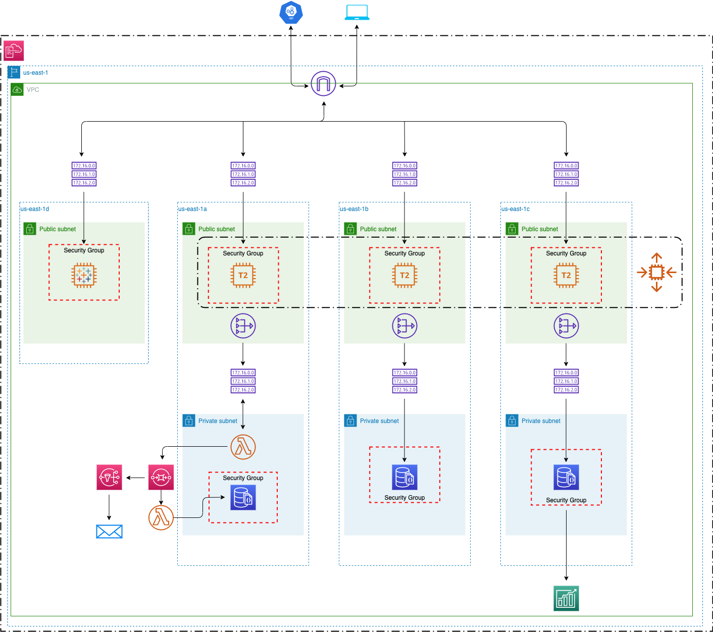

# Melbourne Australia Pedestrian Foot Traffic DE Pipeline

# SF-Business Closures DE Pipeline

Tracking pedestrian foot traffic in Melbourne across year, month, day, time and location. Completely hosted in the AWS ecosystem including a dashboard which will be built with Tableau.

**If you would like to replicate this project follow the README.md file in the cfn directory.**

## Architecture

Data is sourced from Melbourne's Open Data API (https://dev.socrata.com/foundry/data.melbourne.vic.gov.au/b2ak-trbp) and (https://dev.socrata.com/foundry/data.melbourne.vic.gov.au/h57g-5234) as JSON documents containing information on pedestrian foot traffic and sensor locations. A series of Lambda functions orchestrate the data movement and transformations throughout the pipeline. The presentation layer will be created using Amazon Tableau.

## Infrastructure
The project is housed in the AWS ecosystem and utilizes the following resources:

**VPC:**
-   Custom built VPC across 4 AZ's and 7 subnets
-   IGW, NATGW and Route Tables
-   Security Groups

**EC2:**

-   t2.micro - Resource used to SSH into the DocumentDB database
-   m5.4xlarge - Resource used for hosting Tableau Server

**DocumentDB:**

-   Engine version 4.0.0
- db.t3.medium: Resource used for the primary and secondary instances of the database

**3 Lambda Functions:**
-   1 for pulling data from the API and sending it to an SQS Queue
-   1 for transforming the data, loading it to DocumentDB
-   1 for automatic retry of failed SQS messages

**SQS with a dead-letter queue:**
-   For receiving data in batches from the API
-   Deadletter queue for automatic retry of failed messages

**SNS:**
-   For sending failure messages to an email address

**Secrets Manager:**
-   For storing connection variables

**CloudWatch Time-Based Events:**
-   For starting the pipeline

**CloudWatch Event-Based Events:**
-   For automating the data transformations and writing to DocumentDB

**Tableau:**
-   For the visualization layer

**Amazon Forecast:**
-   For predicting the coming months and years foot traffic

## Dashboard

## Points moving forward
 
